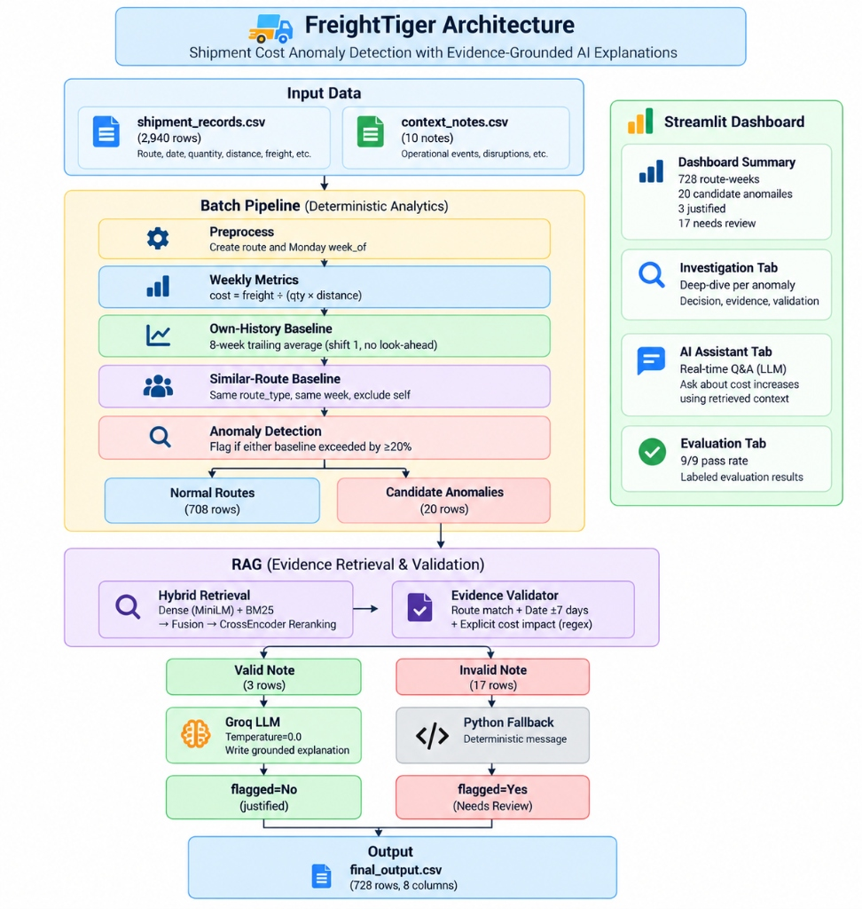

# 🎤 2nd Round Interview — 10-Minute Walkthrough Script

## Before They Start (10:45 AM Setup)

Open these in advance:
1. **Terminal** — run `streamlit run app.py` — keep browser open on Full Output tab
2. **VS Code** — open `src/evidence_validator.py`
3. **File Explorer** — open `output/` folder
4. **README.md** — open in browser or VS Code preview

---

## ⏱️ MINUTE 0:00 — Opening (30 seconds)

**SAY:**
> "Thank you for this opportunity. I'll walk you through exactly what I built, how it works, and how I proved it works correctly. The whole system runs end-to-end in about 90 seconds. Let me start with the problem."

---

## ⏱️ MINUTE 0:30 — Show the Architecture Diagram (1 minute)

**ACTION:** Open `README.md` → scroll to the architecture diagram image at the top.

**KEY POINTS TO POINT AT in the diagram:**
- 🟡 Yellow section = "Pure Python — no AI here at all"
- 🟣 Purple section = "RAG + Deterministic Validator — AI retrieves, Python decides"
- 🟠 Groq LLM box = "Only called 3 times — for 728 rows"
- ➡️ The split at "Candidate Anomalies (20 rows)" = "80% of anomalies are explained or unexplained by Python alone"
- 📊 Right panel = "The Streamlit dashboard — what the user sees"

**SAY:**
> "The task was to monitor weekly shipping costs across routes, detect anomalies, and explain them using AI. I built a 10-step pipeline. Let me walk through it using this diagram.

> The input is two CSV files — 2,940 shipment records and 10 context notes. The pipeline goes through pure Python steps first — preprocessing, calculating cost per tonne-km, building two baselines, detecting anomalies. Then for anomalies only, it runs a Hybrid RAG pipeline to search the context notes, validates the evidence with a deterministic regex checker, and only then — if a valid note is found — calls the LLM. The output is final_output.csv with 728 rows."

---

## ⏱️ MINUTE 1:30 — Show the Output (1.5 minutes)

**ACTION:** Switch to browser → Streamlit → **Full Output tab** → filter "Flagged (Needs Review)"

**SAY:**
> "Here is the main deliverable — the complete output CSV rendered in the dashboard. Let me filter to just the flagged rows."

*Click: Show Flagged (17)*

> "17 route-weeks have unexplained cost spikes — no valid context note was found to justify them. Let me also show you a justified case."

*Click: Show Justified (3)*

> "These 3 rows had a real explanation backed by a context note. The AI wrote the reason column for these — and only these 3 rows. For everything else — Python wrote the message."

---

## ⏱️ MINUTE 3:00 — Show the Investigation Tab (2 minutes)

**ACTION:** Click the **🔎 Investigation tab** → select "✓ Chennai-Bangalore · 2025-03-03"

**SAY:**
> "Let me show the most impressive part — the deep-dive investigation view. I've selected Chennai-Bangalore, week of March 3rd, 2025."

*Point to the three metrics: ₹3.48, +22.8%, +32.0%*

> "The cost was ₹3.48 per tonne-km — 22.8% above this route's own 8-week history, and 32% above similar routes. Both baselines exceeded. Anomaly detected."

*Point to the AI Decision Reason box*

> "The AI found Note N001 — heavy flooding on the Chennai-Bangalore highway from Feb 24 to Mar 8. March 3rd is inside that window. The validator confirmed: route match, date match, explicit cost evidence. Verdict: Justified."

*Now select "⚠ Chennai-Bangalore · 2025-03-10"*

> "Now watch what happens the very next week — March 10th. Same route, similar spike of +22%. But Note N001 says roads were passable again by March 9th. March 10th is the day AFTER. The system automatically rejected this note and flagged the week as unexplained. The system read the expiry date in plain English and enforced it — with zero LLM involvement."

---

## ⏱️ MINUTE 5:00 — Show the Code (1.5 minutes)

**ACTION:** Switch to VS Code → open `src/evidence_validator.py`

**SAY:**
> "Let me show you the most important file in the system — the evidence validator. This is what prevents hallucination."

*Scroll to the positive patterns list*

> "For a note to be accepted, it must contain at least one of these explicit positive phrases — 'surcharge applied', 'higher trip costs', 'pushing up transportation costs' and so on."

*Scroll to the negative patterns list*

> "AND it must contain none of these negative phrases — 'costs were not significantly affected', 'stable demand', 'returned to normal conditions'. This is pure Python regex — not the LLM. The LLM never decides the verdict. It only writes the final explanation sentence after the verdict is already made."

---

## ⏱️ MINUTE 6:30 — Show the Evaluation (1 minute)

**ACTION:** Switch to Streamlit → **🧪 Evaluation tab**

**SAY:**
> "I built a labeled evaluation harness with 9 hand-crafted test cases covering all the tricky edge cases — valid notes, notes with negative phrasing, wrong route, expired date, missing note. All 9 pass."

*Point to the progress bar showing 100%*

> "I also ran the full pipeline 3 times on identical input. The flagged column and matched note ID are identical every run. Reproducibility confirmed."

---

## ⏱️ MINUTE 7:30 — Show the System Tab / Cost (30 seconds)

**ACTION:** Click **⚙️ System tab**

**SAY:**
> "Finally — cost. The LLM was called exactly 3 times for 728 rows. Total cost: $0.0004. That's less than half a US cent. I minimised LLM usage by design — it's only triggered for the 3 anomalies that passed the deterministic validator. Everything else is pure Python."

---

## ⏱️ MINUTE 8:00 — AI Assistant Demo (1.5 minutes)

**ACTION:** Click **💬 AI Assistant tab** → type Q4: "Did the highway maintenance on Mumbai-Delhi cause a cost increase?"

**SAY:**
> "The dashboard also has a live Q&A assistant. I'll ask it a trick question."

*Wait for answer*

> "The system correctly answered NO. Note N005 says costs were not significantly affected. A hallucinating LLM would say yes — maintenance sounds like it would cause costs to rise. This system read the note carefully and said no. This is the anti-hallucination validator working in real time."

---

## ⏱️ MINUTE 9:30 — Closing (30 seconds)

**SAY:**
> "To summarise — what makes this build different from a typical submission:
> 
> One — the verdict is decided by deterministic Python regex, not an LLM opinion.
>
> Two — the RAG uses 4 stages: Dense, BM25, hybrid fusion, Cross-Encoder reranking.
>
> Three — LLM is called only 3 times for 728 rows, keeping cost at $0.0004.
>
> Four — 43 unit tests and a 9/9 labeled evaluation harness prove correctness.
>
> I'm happy to go deeper on any part of this."

---

## 🛡️ Quick Answers for Common Follow-Up Questions

**"What is shift(1) for?"**
> Prevents the rolling baseline from seeing the current week's data — guarantees no look-ahead bias.

**"Why OR logic in anomaly detection?"**
> A spike against either baseline is suspicious. AND would miss cases where only one baseline is exceeded.

**"Why Hybrid RAG not just vectors?"**
> Dense vectors miss exact route name matches. BM25 misses semantic relationships. Hybrid gets both.

**"Did you use LangChain?"**
> No — built natively. Every component is independently testable, auditable, and transparent. No hidden framework magic.

**"What would you add next?"**
> A feedback loop: when a manager resolves a flagged anomaly, that resolution gets added as a new context note — the system learns and improves over time.

---

## 📌 Files Open During Demo (in order of use)

1. `README.md` → architecture diagram at top
2. Streamlit → Full Output tab → filter chips
3. Streamlit → Investigation tab → 2 Chennai-Bangalore cases
4. VS Code → `src/evidence_validator.py`
5. Streamlit → Evaluation tab
6. Streamlit → System tab
7. Streamlit → AI Assistant tab → Q4 (maintenance question)
